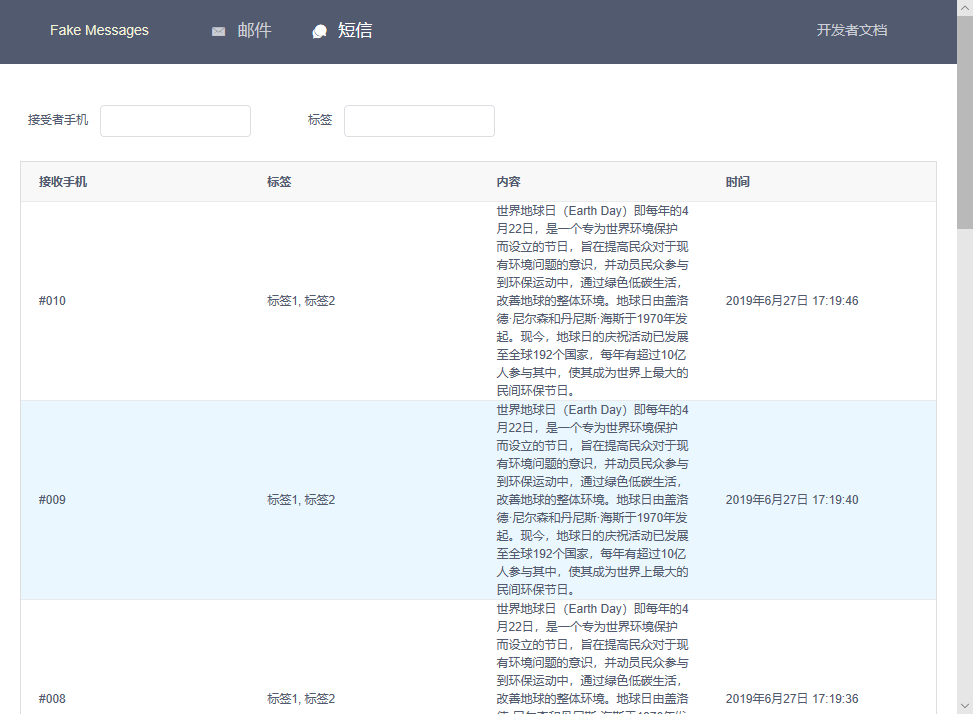

# Fake Messages

> 一个虚拟的邮件和短信服务提供商

邮件和短信服务是我们在项目开发中经常会遇到的功能。常规的框架一般会搭载邮件发送的能力，例如 Rails 的 Action Mailer，Java 的 Java Mail API 等。它们一般都可以通过配置 POP3 协议得以实现。除此之外，市面上还诞生了更多的邮件和短信服务提供商，例如 Mailgun、Submail等。服务商提供了一套发送邮件和短信的接口，我们又可以通过调用接口的方式实现邮件和短信的发送。

例如 Submail，可以如下调用接口发送一封邮件：

```shell
curl -XPOST 'https://api.mysubmail.com/mail/send.json' -d '
appid=your_app_id
&to=leo <leo@submail.cn>
&subject=testing_Subject
&text=testing_text_body
&from=no-reply@submail.cn
&signature=your_app_key'
```

服务商相比于我们自己配置 POP3 协议有一些便利的地方：第一点在于它很简单；第二点在于它为我们处理发送大量邮件的。

我们在生产环境下使用服务商产生生产数据。然而，**在开发环境下，是不适合发送到真实的邮箱和手机号的**。

为此，我特地开发了一套 Fake Messages 系统，你可以理解为一个虚拟的邮箱和短信服务的提供商。在这个提供商里，它也是通过接口的方式发送的。例如，向下面这样发送邮件：

```shell
curl -X POST 'http://{{host}}/emails' -H  'accept: application/json' -H  'Content-Type: application/json' -d '
{
  "email": {
    "toAddress": "receiver@example.com",
    "toName": "接收者",
    "fromAddress": "sender@example.com",
    "fromName": "发送者",
    "tags": [
      "标签1",
      "标签2"
    ],
    "subject": "邮件主题",
    "type": "text",
    "content": "邮件正文"
  }
}'
```

与常规的服务商不同的是，**它所有的邮件和短信都不会发送给真实的用户，而是汇集到该系统本身**。可以通过打开它的界面查看所有接收到的邮件和短信，它们是长这样的：




## 快速上手

### 准备

1. 需要 node，我用的是 node 10.
2. 需要 [yarn](https://yarnpkg.com/lang/zh-hans/docs/install).

### 部署

```shell
# 克隆代码到本地
git clone https://gitee.com/run27017/fake-messages.git

# 进入项目目录
cd fake-messages

# 安装依赖
yarn

# 准备数据库
bin/create_db

# 打包客户端 js 文件
yarn run build

# 启动服务器
PORT=3000 yarn start
```

可以配置 https，传递环境变量 `SSL_KEY_PATH`、`SSL_CERT_PATH`（只许用 pem 格式）。

### 使用

执行部署命令后，数据库文件会生成到路径 db/default.sqlite3. 服务器成功启动后，访问`http://域名:3000`即可进入项目首页。

提供了文档页，声明了发送邮件和短信的接口。可通过点击右上角的**开发者文档**按钮进入，亦可直接访问：

> http://localhost:3000/#/docs

### 开发

如果需要参与到项目开发，可运行开发环境的命令：

```shell
yarn run dev
```

该命令同时启动了两个开发用的服务：

1. HTTP 服务器
2. Webpack 打包客户端的 js 代码

两个服务都能监听到代码的改动。一旦对应的代码改动，HTTP 服务器会主动重启，Webpack 会重新打包。

其他的有用的开发环境下的命令列举如下：

- `bin/seeds`: 创建一些种子数据。

## 适配器模式

将 Fake Messages 理解为一个服务提供商，将其纳入到你的项目开发中去。在你的项目中，可能会引入多个服务提供商，例如 Mailgun、Submail、阿里云等等。你需要自如地在这些服务商中来回切换，就需要用到适配器模式。

在适配器模式中，首先你需要一个代理类，它作为邮件和短信发送的对外出口。代理类是一个通用的协议，它定义的方法才会直接暴露给开发者。而真正实现邮件和短信的发送的实体类，隐藏在代理类内部，并可自由配置。

例如，我定义的邮件发送代理类（以我最拿手的 Ruby 语言为例）：

```ruby
class EmailSender
    attr_accessor :impl # 真正实现邮件发送的实体对象，发送邮件的动作会转发到该类执行
    
    def send(options)
        # 可能会有一些其他处理，如格式化参数、打印日志、捕获异常等
        impl.send(options)
    end
end
```

假设现在系统内已经有三个服务商的实现：

```ruby
class MailgunEmailSender
end

class SubmailEmailSender
end

class FakeEmailSender
end
```

那我们使用 Mailgun 的实现：

```ruby
sender = EmailSender.new
sender.impl = MailgunEmailSender.new
```

切换到 Submail 的实现也很简单：

```ruby
sender.impl = SubmailEmailSender.new
```

通常我们会在配置文件中配置 adapter，然后在初始化的时候读取。

```ruby
# config/development.settings.yml
EmailSender:
	Adapter: FakeEmailSender

# config/production.settings.yml
EmailSender:
	Adapter: SubmailEmailSender

# config/initializers/email_sender.rb
$email_sender = EmailSender.new
$email_sender.impl = Settings.EmailSender.Adapter.constantize.new
```

如此一来，全局的`$email_sender`变量就是我们的代理类了。它会在开发环境使用`FakeEmailSender`，在生产环境使用`SubmailEmailSender`.

这就是适配器模式的大体思路了，它非常适合这种多服务商实现的场景。像 Java 中的 JDBC，Rails 中的异步任务框架等，其思路也是适配器模式。类似的例子不胜枚举，有兴趣的同学可谷歌“适配器模式”查看更多资料。

## 技术架构

项目的前后端采用完全分离的模式，前端使用 vue 实现单页应用，并调用后端的 JSON 格式的接口，后端使用 Express 框架构建。虽然前后端是完全分离的，但我任然把前后端的代码放在同一个项目内。Express 作为服务器的载体，同时伺服前后端的代码。

目录结构：

- /server：服务器的代码
- /client：客户端的源，它会被 WebPack 打包，生成到 /public 目录下
- /public：静态文件的根目录，其中的 /public/app.js 是 WebPack 打包后的单页代码

基础工具：

- Yarn：替代 npm 工具
- sqlite3：数据库
- websocket：用于实时通信

后端：

- Express：后端框架

前端：

- Webpack：用于打包客户端 js 代码
- Vue：前端框架
- iView：前端 UI
- Sass：CSS 预处理器

## 愿景

虽然这个项目目前很小，实现的功能很基础，但我希望它能够成为像 Mailgun、Submail 那样具有完全功能的项目。 所以我将其开源，希望依靠社区的力量。

## License

[GNU GPL v3](http://www.gnu.org/licenses/gpl-3.0.html)
